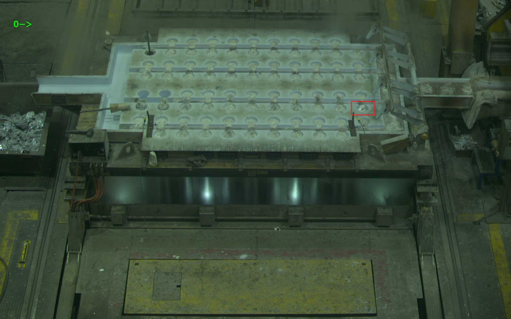

# Лабораторная работа №1 | Байесовская генерация и автоэнкодеры

## Задача-1 | Байесовская генерация стилей
**Идея:**
Решение задачи генерации данных с условием независимости компонентов случайной величины.

**Описание задачи:**
Используя данные о популярных стилях из файла styles.py написать генератор (можно в виде функции, можно в виде класса [generator](https://wiki.python.org/moin/Generators)):
1. На основе формулы MLE и формулы Байеса о полной вероятности генерировать случайный стиль с возвращением вероятности;
2. Используя в качестве фичей пиксели изображений аватаров (см папку avatars) написать генератор изображений, который генерирует новый аватар: генератор выбирает значение каждого канала каждого пикселя используя распределение вероятностей, полученных на основе изображений avatars; генерация так же осуществляется с помощью MLE;
3. Выложить в репозиторий 5 сгенерированных аватаров

**Датасет:**
1. данные о стилях (см. файл `styles.py`)
2. изображения аватаров (см. папку `avatars`)

**Эксперименты:** -
**Результаты обучения:**
1. Пример результата генератора словаря стилей:
<div align="left">
    
</div>
2. 5 примеров результата попиксельного генератора стилей:
<div align="left">
    
    
    
    
    

</div>

**Директории/Файлы:**
- Блокнот с генератором словаря стилей и попиксельным генератором: 
`notebooks/styles_generator.ipynb`
- Файлы с результатами попиксельной генерации: `generated_avatars`
- Файл с зависимостями: `requarements.txt`


## Задача-2 | Классификации лунок
**Идея:**
Решение задачи классификации с помощью автоэнкодоров в условиях сильной разбалансировки классов.

**Описание задачи:**
Используя изображения лунок, в которые льют металл, написать и обучить автоэнкодер для определения проливов металла:
1. Имплементировать или найти автоэнкодер (можно для старта взять пример из лекции по автоэнкодерам);
2. Обучить автоэнкодер на не_проливах (dataset\train)
    **Замечание:** если через такой автоэнкодер прогнать изображение пролива, то MSE между входным изображением и выходным будет больше, чем если прогнать изображение без пролива. Следовательно, если определить некоторое пороговое значение MSE, можно классифицировать изображение на классы пролив\не_пролив. Если MSE между входной картинкой и выходной больше фиксированного порога, то на изображении пролив.
3. Написать метод классификации лунок;
4. На изображениях из dataset\test протестировать качество;(True_positive_rate и True_negative_rate).

**Датасет:**
Данные - вырезанные изображения лунок, в которые льют металл.


```
dataset
├── proliv  # изображения с проливами
|       ├── 000.jpg
│       ├── 001.jpg
│       │   └── ...
|
├── test  # тестовая выборка где перемешаны проливы и не_проливы
│       ├── imgs
│       │   ├── 000.jpg
│       │   ├── 001.jpg
│       │   └── ...
│       └── test_annotation.txt
|
├── train  #  обучающая выборка из не_проливов
|       ├── 000.jpg
│       ├── 001.jpg
│       └── ...
```

**Эксперименты:** -
**Результаты обучения:**
Секция с результатами обучения должна содержать:
1. График лосс-функции в процессе обучения:
2. График метрик на валидационной выборке во время обучения
3. Метрик качества классификатора: \
    True Positive Rate (TPR): 0.7907 \
    True Negative Rate (TNR): 0.8442


**Директории/Файлы:**
- Блокнот решения задачи классификации лунок автоэнкодером:
`notebooks/autoencoder_cls.ipynb`
- Файл с зависимостями: `requarements.txt`