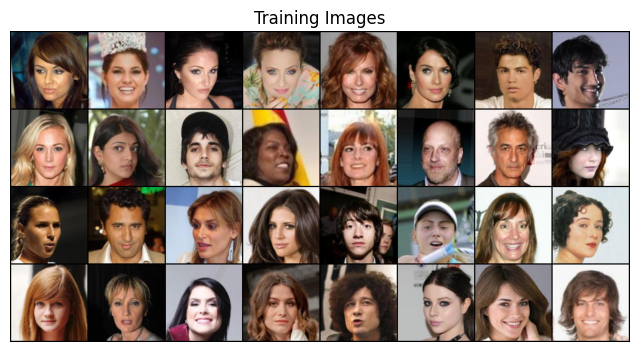
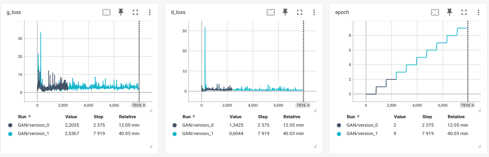
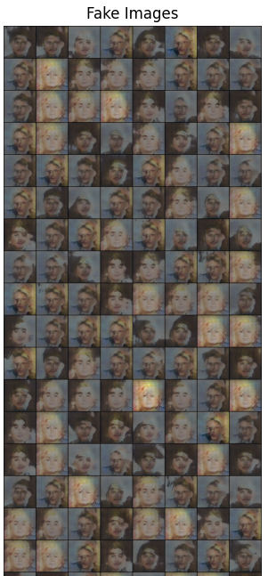
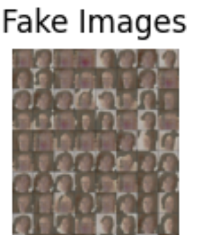

# Лабораторная работа №2 | Имплементация GAN

**Описание задачи:**
1. Имплементировать CSPup блок
<div style='text-align:center'>
  
</div>
2. Имплементировать генератор GAN по заданной архитектурной схеме
<div style='text-align:center'>
  
</div>
3. Обучить имплементированный GAN
4. Добиться схдимости (регуляризации, изменение архитектуры, фишки с train loop)

**Датасет:** [CelebA](https://mmlab.ie.cuhk.edu.hk/projects/CelebA.html)



### Результаты
#### GAN

```text
Generator(
  (norm): ConvTranspose2d(100, 1024, kernel_size=(4, 4), stride=(1, 1), bias=False)
  (csp_up_block1): CSPUpBlock(
    (upsample): ConvTranspose2d(512, 512, kernel_size=(2, 2), stride=(2, 2))
    (upsample1): ConvTranspose2d(512, 512, kernel_size=(2, 2), stride=(2, 2))
    (conv1): Conv2d(1024, 512, kernel_size=(3, 3), stride=(1, 1), padding=(1, 1))
    (relu): LeakyReLU(negative_slope=0.2, inplace=True)
    (conv3_1): Conv2d(512, 512, kernel_size=(3, 3), stride=(1, 1), padding=(1, 1))
    (conv3_2): Conv2d(512, 512, kernel_size=(3, 3), stride=(1, 1), padding=(1, 1))
  )
  (csp_up_block2): CSPUpBlock(
    (upsample): ConvTranspose2d(256, 256, kernel_size=(2, 2), stride=(2, 2))
    (upsample1): ConvTranspose2d(256, 256, kernel_size=(2, 2), stride=(2, 2))
    (conv1): Conv2d(512, 256, kernel_size=(3, 3), stride=(1, 1), padding=(1, 1))
    (relu): LeakyReLU(negative_slope=0.2, inplace=True)
    (conv3_1): Conv2d(256, 256, kernel_size=(3, 3), stride=(1, 1), padding=(1, 1))
    (conv3_2): Conv2d(256, 256, kernel_size=(3, 3), stride=(1, 1), padding=(1, 1))
  )
  (csp_up_block3): CSPUpBlock(
    (upsample): ConvTranspose2d(128, 128, kernel_size=(2, 2), stride=(2, 2))
    (upsample1): ConvTranspose2d(128, 128, kernel_size=(2, 2), stride=(2, 2))
    (conv1): Conv2d(256, 128, kernel_size=(3, 3), stride=(1, 1), padding=(1, 1))
    (relu): LeakyReLU(negative_slope=0.2, inplace=True)
    (conv3_1): Conv2d(128, 128, kernel_size=(3, 3), stride=(1, 1), padding=(1, 1))
    (conv3_2): Conv2d(128, 128, kernel_size=(3, 3), stride=(1, 1), padding=(1, 1))
  )
  (csp_up_block4): CSPUpBlock(
    (upsample): ConvTranspose2d(64, 64, kernel_size=(2, 2), stride=(2, 2))
    (upsample1): ConvTranspose2d(64, 64, kernel_size=(2, 2), stride=(2, 2))
    (conv1): Conv2d(128, 64, kernel_size=(3, 3), stride=(1, 1), padding=(1, 1))
    (relu): LeakyReLU(negative_slope=0.2, inplace=True)
    (conv3_1): Conv2d(64, 64, kernel_size=(3, 3), stride=(1, 1), padding=(1, 1))
    (conv3_2): Conv2d(64, 64, kernel_size=(3, 3), stride=(1, 1), padding=(1, 1))
  )
  (deconv2d): ConvTranspose2d(64, 3, kernel_size=(2, 2), stride=(2, 2))
  (relu): LeakyReLU(negative_slope=0.2, inplace=True)
)
Discriminator(
  (conv1): Conv2d(3, 64, kernel_size=(4, 4), stride=(2, 2), padding=(1, 1))
  (conv2): Conv2d(64, 128, kernel_size=(4, 4), stride=(2, 2), padding=(1, 1))
  (conv3): Conv2d(128, 256, kernel_size=(4, 4), stride=(2, 2), padding=(1, 1))
  (conv4): Conv2d(256, 512, kernel_size=(4, 4), stride=(2, 2), padding=(1, 1))
  (conv5): Conv2d(512, 1024, kernel_size=(4, 4), stride=(2, 2), padding=(1, 1))
  (conv6): Conv2d(1024, 1, kernel_size=(4, 4), stride=(1, 1))
  (relu): LeakyReLU(negative_slope=0.2, inplace=True)
  (sigmoid): Sigmoid()
)

```
#### Обучение модели



Обнаружен mode colapse.
Эксперименты:
- Уменьшение learninge rate у дескриминатора
- Изменение количества эпох
- Модификация CSPup-блока - изменение функции активации

<div style='text-align:center'>
  
  <p style='text-align:center'> Обучение на 3х эпохах </p>
</div>

<div style='text-align:center'>
  
  <p style='text-align:center'> Обучение на 10и эпохах </p>
</div>


**Директории/Файлы:**
- Блокноты решения задачи:
  - Структурированная версия (pytorch_lightning) - `source/pl_wrapper.py`
  - Имплементация CSPup и реализация дескриминатора - `source/model.py`
  - Обучение модели: `notebooks/run.ipynb`
- Файл с зависимостями: `requirements.txt`