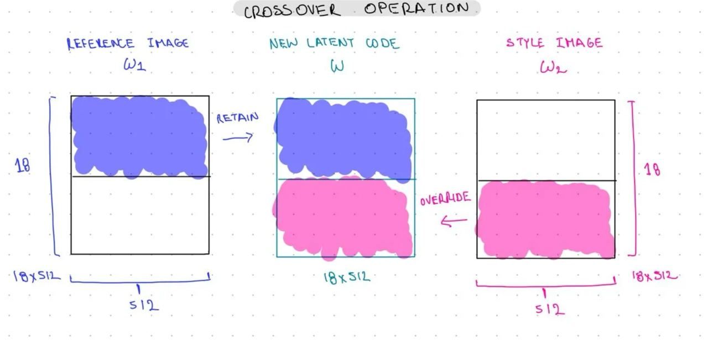
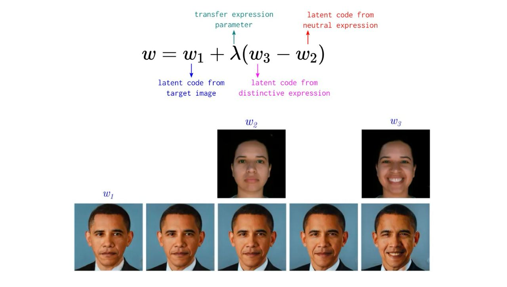

# Лабораторная работа №3 | StyleGAN

**Данные:**
4-6 разных людей, в наборе должны быть хотя бы 2 фото с разными поворотами головы помимо смотрящих прямо

## Задача-1 | Латентное пространство 
**Идея:**
Научиться получать стили для изображений пользователя с помощью латентого пространства StyleGAN

**Описание задачи:**
1. Кадрировать изображения;
2. Найти проекции изображений в пространстве StyleGAN.

**Результаты:**

    

        
        
Mapping Network

    

## Задача-2 | Style transfer
**Идея:**
Применить к исходному изображению новые стили

**Описание задачи:**
Изменяется цвет, свет, текстура, но человек должен остаться прежним. Пробуем самый простой метод для трансфера стиля с одного лица на другой с помощью смешивания векторов, хватит трех стилей.

    

**Результаты:**

    
Оригинальные изображения:

    

    
Изображения из латентного пространства и результат смешевания стилей:

    

## Задача-3 | Expression Transfer
**Идея:**
Перенести эмоцию с одного изображения на другое

    

**Описание задачи:**
Три любые эмоции по аналогии с предыдущими пунктами

**Результаты:**

    
Оригинальные изображения:

    

    
Изображения из латентного пространства и результат - добавление эмоции:

    

## Задача-4 | Face swap
**Идея:**
Перенести личность с одной фотографии на другую, сохраняя при этом угол поворота и цвет для исходного лица

**Описание задачи:**
Добавить Arcface-loss в пайплайн и провести оптимизации весов

**Результаты:**

    

**Директории/Файлы:**
- Блокнот решения задач:
`notebooks/run.ipynb`

