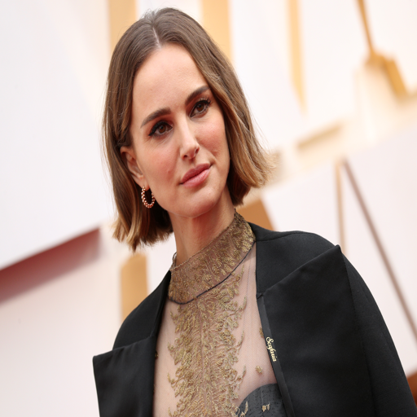

# Лабораторная работа №4 | Обучение Stable diffusion 1.5 методом Dreambooth

**Идея Dreambooth**
TextToImage модель генерирует изображения по какому-то распределению, например по запросу "a photo of woman face", модель генерирует фотографию рандомной женщины. Мы хотим сгенерировать фотографию конкретной женщины, фотографий которой не было датасета при обучении модели, но если обучать модель на небольшом наборе, то неизбежно будем терять уже имеющие знания модели. Dreambooth отчасти решает эту проблему обучая модель в два этапа, на нашем датасете `instance images` и на регуляризационном датасете `class images`, который собирается из генераций модели.

**Описание задачи:**
1. Собрать датасет от 15 изображений одно персонажа
2. Обрезать и заресайзить лица ([тут обработка всех](https://civitai.com/))
    Для лучшего качества и вариативности лучше брать изображения с  разным размером кадра от close-up до medium см. Таблица 1, соотношение можно взять 1 к 1.

    Если в трэйне будут только крупные лица то при генерации вряд ли получится хороший средний или крупный план.
3. Скачать предобученный чекпоинт SD1.5 с [civitai.com](https://civitai.com/)
    Мы будем использовать библиотеку diffusers и их скрипты для обучения. Чтобы генерации получались более красивые, будем брать предобученные модели с сайта civitai. Формат весов в нем отличается и туда вкладывают только unet поэтому сначала модель нужно конвертировать в формат diffusers.
4. Обучить Stable diffusion 1.5.
    Параметры
    ```
    --instance_prompt="a photo of sks woman face" токен на который мы хотим обучить персонажа
    --class_prompt="a photo of woman face" промт для регуляризации
    ```
    Чтобы не было language drift (когда модель уже содержит знания в каком-то из токенов) мы используем токен sks он был выбран авторами статьи как один и наименее частотных в датасете.
    ```
    --instance_data_dir=$INSTANCE_DIR
    --class_data_dir=$CLASS_DIR
    ```
    Чтобы модель не забывала уже то, что знает и не переобучилась используется регуляризационный датасет (class images генерируется автоматически по промту class_prompt), чтобы изображения были более качественные можете самостоятельно собрать этот набор).
    \
    **Замечание:** В примере из ноутбука я отдельно собрал class images (добавил negative promt и заменил prompt) чтобы размер кадра больше соответствовал примерам из обучения и картинки были более качественные и разнообразные, а не только крупный план лица.

5. Обучить LoRA модель
    При успехе обучения чекпоинта целиком, обучить LoRA модель. Ссылка на скрипт обучения и функцию загрузки весов в пайплайн есть в ноутбуке DreamBooth_Stable_Diffusion.ipynb.

    Провести 3 эксперимента по подбору размера LoRa (параметр --rank) Смотрим как размер модели влияет на количество итераций и итоговое качество. В readme добавить варианты генерации по каждой из моделей.

6. Сравнить лучший чекпоинт Unet и Lora
    Один лучший чекпоинт обучения Unet и Одна лучшая LoRA модель

7. ControlNet
    Генерация любого варианта Controlnet из ноутбука, для обученных Unet и Lora


### Обучение SD 1.5
<div class="row" style="display: flex;">
  <div class="column" style="display: flex; padding: 5px;">
      <div>
            
            <div style="display: flex; justify-content: center;">1</div>
      </div>
  </div>
  <div class="column" style="display: flex; padding: 5px;">
      <div>
            
            <div style="display: flex; justify-content: center;">2</div>
      </div>
  </div>
</div>
<div class="row" style="display: flex;">
 <div class="column" style="display: flex; padding: 5px;">
      <div>
            
            <div style="display: flex; justify-content: center;">3</div>
      </div>
  </div>
</div>


### Обучение LoRA
<div class="row" style="display: flex;">
  <div class="column" style="display: flex; padding: 5px;">
      <div>
            
            <div style="display: flex; justify-content: center;">Ранг 4</div>
      </div>
  </div>
  <div class="column" style="display: flex; padding: 5px;">
      <div>
            
            <div style="display: flex; justify-content: center;">Ранг 16</div>
      </div>
  </div>
   <div class="column" style="display: flex; padding: 5px;">
      <div>
            
            <div style="display: flex; justify-content: center;">Ранг 32</div>
      </div>
  </div>
</div>

### ControlNet

<div class="row" style="display: flex;">
  <div class="column" style="display: flex; padding: 5px;">
      <div>
            
            <div style="display: flex; justify-content: center">Базовое изображение</div>
      </div>
  </div>
  <div class="column" style="display: flex; padding: 5px;">
      <div>
            
            <div style="display: flex; justify-content: center;">Canny</div>
      </div>
  </div>
</div>
<div class="row" style="display: flex;">
    <div class="column" style="display: flex; padding: 5px;">
      <div>
            
            <div style="display: flex; justify-content: center;">ControlNet processing</div>
      </div>
  </div>
</div>

**Вывод**
В проведенных экспериментах лучшие результаты показываета SD Dreambooth.


**Директории/Файлы:**
- Блокноты решения задачи:
  - `notebooks/DreamBooth_Stable_Diffusion.ipynb`
  - `notebooks/Controlnet.ipynb.ipynb`